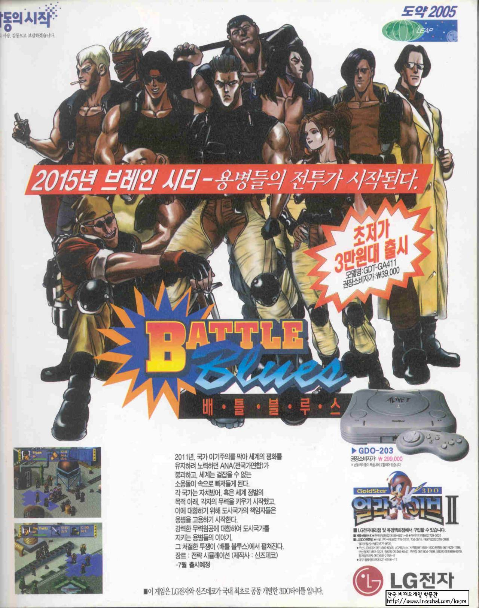

# Battle Blues (3DO) English Translation 

Battle Blues (배틀 블루스) is a CyberPunk SRPG made by Shin's Entertainment in 1996 and published by LG electronics who produced their very own 3DO systems in South Korea at the time. 
The game was never localized for a western audience as the 3DO did not sell well in the West, let alone in Korea. 

    

## Translation Procedure

Unlike other games where text is usually encoded and stored seperately from the game's graphics, the text in this game is embedded in proprietary 3DO image/sprite .cel format files. Modifying the game means modifying these .cel files.
In order to extract the .cel files, modify them and rebuild the game to run on an unmodified 3DO bios, we can make use of the tools found in the TOOLS section of this repository: 

1. OperaFS: De-Compile (Select "ISO, BIN, NRG" and browse for the Battle Blues .iso or .img file)
2. Once uncompiled, run 3DOResExplorer8(Neuro).exe and browse to (...)\PARCE_Battle Blues\pic where the 3DO image files (in proprietary .cel format) are contained.
3. Select an image in the 3DOResExplorer explorer to view it, then select Command and save to export it as a .bmp image
4. Edit the image with your favorite image editor (GIMP, Photoshop, ...) and make sure to export as 24-bit 
5. Use BmpTo3DOCel.exe to conver the edited .bmp back to .cel
6. OperaFS: Compile (Browse the uncompiled game ) -> export as .iso
7. Sign your game and regenerate rom_tags : 3DOEncrypt.exe genromtags ISOFILE.iso
